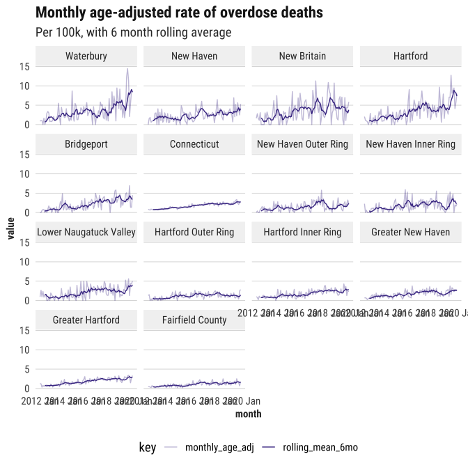
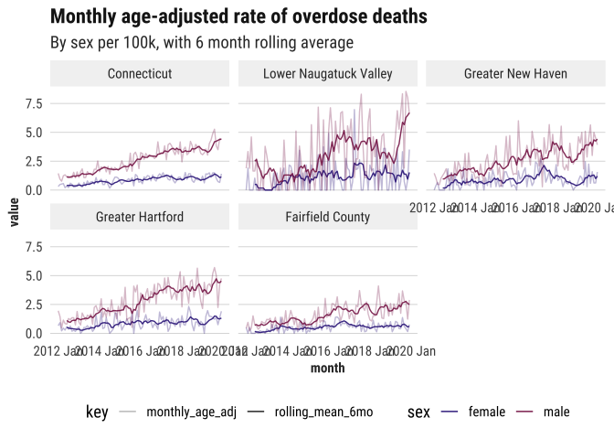
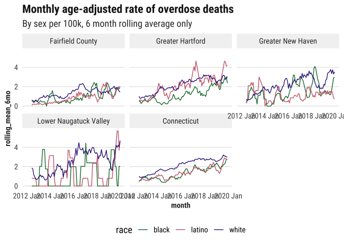
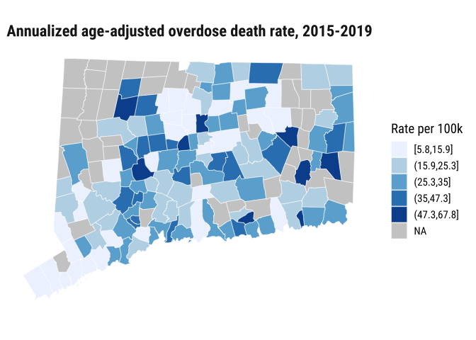
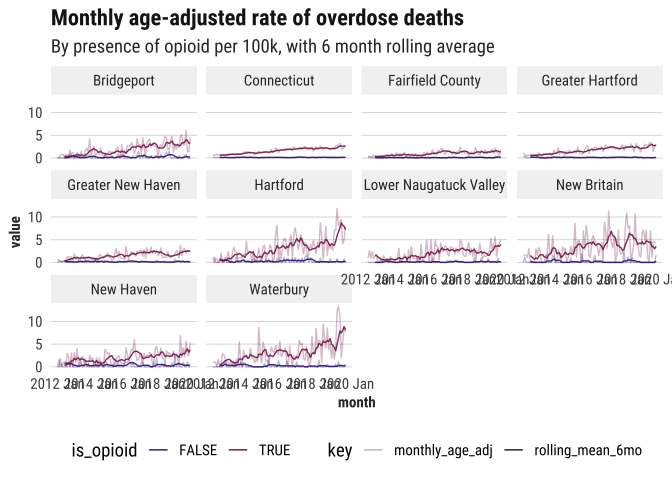
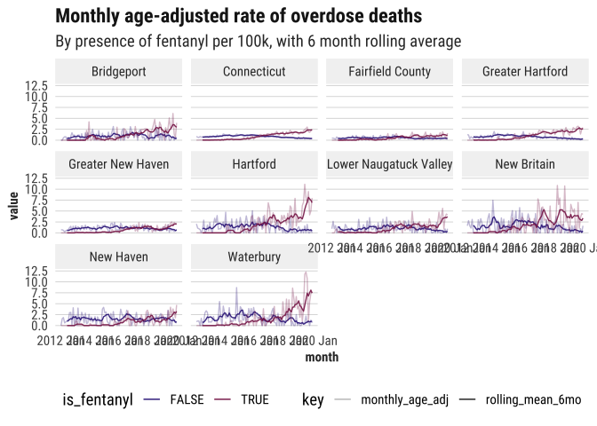
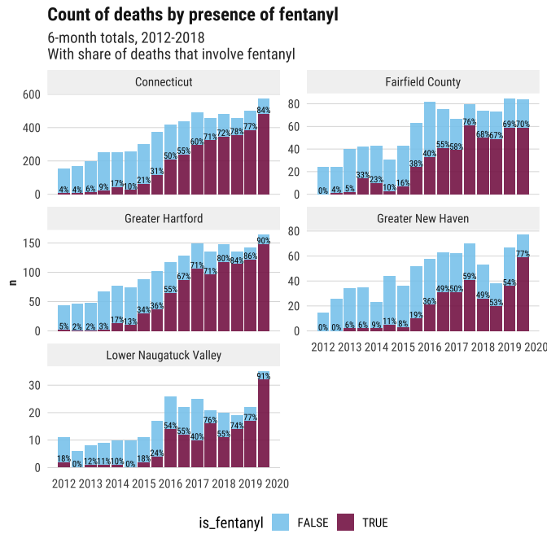
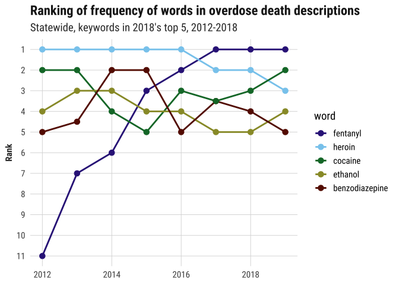
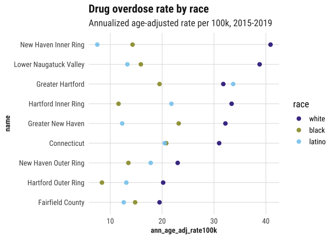

2019 Index: Drug overdoses
================

``` r
library(tidyverse)
library(camiller)
library(cwi)
library(showtext)
library(sf)
library(tidycensus)
library(lubridate)
library(tsibble)
library(feasts)
source("../_utils/misc_functions.R")
```

Copied from health\_equity repo (copied from 2019index)

``` r
cluster_lst <- ct5_clusters %>%
  split(.$cluster) %>%
  map(pull, town)
```

``` r
pop_age <- multi_geo_acs("B01001", regions = cluster_lst) %>%
  label_acs() %>%
  separate(label, into = c("total", "sex", "age"), sep = "!!") %>%
  filter(!is.na(age)) %>%
  extract(age, into = c("min_age", "max_age"), regex = "^(\\d+)?[\\sA-Za-z]+(\\d+)?") %>%
  mutate_at(vars(ends_with("_age")), as.numeric) %>%
  replace_na(list(min_age = 0)) %>%
  mutate(age_brk = cut(min_age, breaks = c(0, seq(10, 85, by = 5), 100), include.lowest = TRUE, right = FALSE) %>%
           fct_relabel(age_brks)) %>%
  group_by(level, name = NAME, age_brk) %>%
  summarise(pop = sum(estimate))

saveRDS(pop_age, "../raw_data/pop_by_age.rds")

pop_read <- c(total = "", white = "H", black = "B", latino = "I") %>%
  map_chr(~paste0("B01001", .)) %>%
  map(~multi_geo_acs(table = ., year = 2018, regions = cwi::regions[main_regions])) %>%
  map(filter, !str_detect(level, "counties")) %>%
  map(label_acs)
saveRDS(pop_read, "../raw_data/pop_by_age_race_sex.rds")
```

``` r
pop_age <- readRDS("../raw_data/pop_by_age.rds") %>%
  ungroup() %>%
  mutate(level = fct_relabel(level, str_remove, "^\\d+_"))

drugs_indiv <- read_csv("../output_data/overdoses_indiv_2012_2019.csv") %>%
  mutate(date = as.Date(date)) %>%
  mutate_at(vars(town, county), str_to_title) %>%
  mutate(age_grp = cut(age, breaks = c(0, seq(10, 85, by = 5), 100), right = FALSE) %>%
           fct_relabel(age_brks))

cdc_wts <- read_csv("../raw_data/cdc_us_standard_pop_weights.csv") %>%
  mutate(age_grp = as_factor(age_grp) %>%
           fct_relabel(str_replace, "plus", "99"))
```

``` r
opioid <- bind_rows(
  drugs_indiv %>% mutate(name = "Connecticut", level = "state"),
  drugs_indiv %>%
    left_join(ct5_clusters, by = "town") %>%
    rename(name = cluster) %>%
    mutate(level = "regions")
) %>%
  mutate(is_opioid = ifelse(is_opioid, "opioids_only", "not_opioid"))

daily_ts <- bind_rows(
  opioid %>% mutate(is_opioid = "all_drugs"),
  opioid %>% filter(is_opioid == "opioids_only")
) %>%
  count(level, date, name, is_opioid, age_grp) %>%
  as_tsibble(index = date, key = c(level, name, is_opioid, age_grp)) %>%
  mutate_if(is.factor, as.character) %>%
  fill_gaps(n = 0, .full = TRUE) %>%
  left_join(pop_age, by = c("level", "name", "age_grp" = "age_brk")) %>% 
  left_join(cdc_wts, by = "age_grp") # join pop. weights

drugs_ts <- daily_ts %>%
  index_by(month = yearmonth(date)) %>% 
  group_by(level, name, is_opioid, age_grp, pop, cdc_age_wt) %>%
  summarise(n = sum(n)) %>%
  mutate(rate = n / pop * 1e6) %>%
  group_by(level, name, is_opioid) %>%
  summarise(monthly_n = sum(n),
            monthly_age_adj = sum(rate * cdc_age_wt)) %>% 
  group_by_key() %>%
  mutate(rolling_mean_6mo = slider::slide_dbl(monthly_age_adj, mean, .before = 6, .complete = TRUE)) %>%
  # mutate(rolling_mean_6mo = ifelse(is.na(rolling_mean_6mo_0), monthly_age_adj, rolling_mean_6mo_0)) %>% 
  ungroup()
```

``` r
yrs <- 2015:2019

annual_15_19 <- daily_ts %>%
  index_by(year = year(date)) %>% 
  filter(between(year, !!!range(yrs))) %>%
  as_tibble() %>%
  group_by(level, name, is_opioid, age_grp, pop, cdc_age_wt) %>%
  summarise(n = sum(n)) %>%
  mutate(ann_rate = n / pop * 1e5 / length(yrs)) %>%
  group_by(level, name, is_opioid) %>%
  summarise(total_n = sum(n),
            avg_annual_age_adj = sum(ann_rate * cdc_age_wt)) %>% 
  ungroup() %>%
  mutate(level = as_factor(level) %>% fct_relevel("state")) %>%
  arrange(level)
```

write files

``` r
drugs_ts %>%
  mutate_at(vars(level, is_opioid), as_factor) %>%
  mutate(level = fct_relevel(level, "state")) %>%
  arrange(level, name) %>%
  saveRDS("../output_data/drug_overdose_5ct_monthly_ts_1mil.rds")

write_csv(annual_15_19, "../output_data/annual_avg_drug_deaths_100k_2015_2019.csv")
```

## Camille

``` r
font_add_google("Roboto Condensed", "roboto")
showtext_auto()
tol12 <- ggthemes::ptol_pal()(12)
source("../_utils/geographies.R")

region_df <- cwi::regions %>%
  enframe(name = "region", value = "town") %>%
  unnest()
```

``` r
age_brks <- function(x) {
  splits <- x %>%
    str_remove_all("[\\[\\]\\(\\)]") %>%
    str_split(",")
  splits %>%
    map_chr(function(xs) {
      x1 <- xs[1]
      x2 <- as.numeric(xs[2]) - 1
      sprintf("ages%s_%s", x1, x2)
    })
}

# for replacing with wider breaks for rates by race
age_wide_brks <- list(
  ages00_14 = c("ages00_09", "ages10_14"),
  ages15_24 = c("ages15_19", "ages20_24"),
  ages25_34 = c("ages25_29", "ages30_34"),
  ages35_44 = c("ages35_39", "ages40_44"),
  ages45_54 = c("ages45_49", "ages50_54"),
  ages55_64 = c("ages55_59", "ages60_64"),
  ages65_74 = c("ages65_69", "ages70_74"),
  ages75_84 = c("ages75_79", "ages80_84")
)
```

Need to do:

  - Counts of overdose deaths
  - Population by age to match age groups in CDC weights
  - Rates
  - Age-adjusted rates

<!-- end list -->

``` r
drugs_indiv <- read_csv("../output_data/overdoses_indiv_2012_2019.csv")
cdc_wts <- read_csv("../raw_data/cdc_us_standard_pop_weights.csv") %>%
  mutate(age_grp = as_factor(age_grp) %>%
           fct_relabel(str_replace, "plus", "over"))
```

``` r
pop_read <- readRDS("../raw_data/pop_by_age_race_sex.rds")
# different age groupings for total pop & by race
pop_by_age <- pop_read[["total"]] %>%
  separate(label, into = c("total", "sex", "age"), sep = "!!") %>%
  filter(!is.na(age) | (is.na(age) & is.na(sex))) %>% 
  mutate(age = as_factor(age) %>%
           fct_relabel(str_replace_all, " (to|and) ", "_") %>%
           fct_relabel(str_remove, " years") %>%
           fct_relabel(~paste0("ages", .)) %>%
           fct_collapse(ages00_09 = c("agesUnder 5", "ages5_9"),
                        ages15_19 = c("ages15_17", "ages18_19"),
                        ages20_24 = c("ages20", "ages21", "ages22_24"),
                        ages60_64 = c("ages60_61", "ages62_64"),
                        ages65_69 = c("ages65_66", "ages67_69")) %>%
           fct_explicit_na(na_level = "total_pop") %>%
           fct_relevel("total_pop")) %>%
  mutate(level = fct_relabel(level, str_remove, "^\\d+_")) %>%
  group_by(level, name = NAME, age_grp = age) %>%
  summarise(pop = sum(estimate))
```

``` r
pop_by_age_sex <- pop_read[["total"]] %>%
  separate(label, into = c("total", "sex", "age"), sep = "!!") %>%
  filter(!is.na(age)) %>%
  mutate(age = as_factor(age) %>%
           fct_relabel(str_replace_all, " (to|and) ", "_") %>%
           fct_relabel(str_remove, " years") %>%
           fct_relabel(~paste0("ages", .)) %>%
           fct_collapse(ages00_09 = c("agesUnder 5", "ages5_9"),
                        ages15_19 = c("ages15_17", "ages18_19"),
                        ages20_24 = c("ages20", "ages21", "ages22_24"),
                        ages60_64 = c("ages60_61", "ages62_64"),
                        ages65_69 = c("ages65_66", "ages67_69"))) %>%
  mutate(level = fct_relabel(level, str_remove, "^\\d+_"),
         sex = as.factor(sex) %>% fct_relabel(str_to_lower)) %>%
  group_by(level, name = NAME, sex, age_grp = age) %>%
  summarise(pop = sum(estimate))
```

``` r
pop_by_age_race <- pop_read[c("white", "black", "latino")] %>%
  bind_rows(.id = "race") %>%
  separate(label, into = c("total", "sex", "age"), sep = "!!") %>%
  filter(!is.na(age)) %>%
  mutate(age = as_factor(age) %>%
           fct_relabel(str_replace_all, " (to|and) ", "_") %>%
           fct_relabel(str_remove, " years") %>%
           fct_relabel(~paste0("ages", .)) %>%
           fct_collapse(ages00_14 = c("agesUnder 5", "ages5_9", "ages10_14"),
                        ages15_24 = c("ages15_17", "ages18_19", "ages20_24"),
                        ages25_34 = c("ages25_29", "ages30_34"))) %>%
  mutate(level = fct_relabel(level, str_remove, "^\\d+_"),
         sex = as.factor(sex) %>% fct_relabel(str_to_lower)) %>%
  group_by(level, name = NAME, sex, race, age_grp = age) %>%
  summarise(pop = sum(estimate))

cdc_wt_race <- cdc_wts %>%
  mutate(age_grp = fct_collapse(age_grp, !!!age_wide_brks)) %>%
  group_by(age_grp) %>%
  summarise_all(sum)
```

Make a time series object with lots of groupings included (sex, age),
then rollup later when I don’t need disaggregations. Keeping a separate
time series for counts by race, since ages are different.

*6/21*: adding in large towns with high counts. Filtering for towns with
average 25 deaths per year–totally arbitrary, but gets 5 major towns to
highlight.

``` r
city_min_n <- 25
cities <- drugs_indiv %>%
  group_by(town, year) %>%
  summarise(n = n()) %>%
  summarise(avg_n = mean(n)) %>%
  filter(avg_n >= city_min_n)
```

    ## `summarise()` regrouping output by 'town' (override with `.groups` argument)

    ## `summarise()` ungrouping output (override with `.groups` argument)

``` r
drugs_ts <- bind_rows(
  drugs_indiv %>% 
    mutate(name = "Connecticut", level = "state"),
  drugs_indiv %>% 
    inner_join(region_df, by = "town") %>% 
    rename(name = region) %>%
    mutate(level = "regions"),
  drugs_indiv %>% 
    semi_join(cities, by = "town") %>%
    rename(name = town) %>%
    mutate(level = "towns")
) %>%
  mutate(level = as_factor(level)) %>%
  # mutate_at(vars(region, sex), as_factor) %>%
  count(date, level, name, sex, age_grp, is_opioid, is_fentanyl) %>%
  as_tsibble(index = date, key = c(level, name, sex, age_grp, is_opioid, is_fentanyl)) %>%
  fill_gaps(n = 0, .full = TRUE)

# need to redo age breaks for by race
drugs_race_ts <- bind_rows(
  drugs_indiv %>% mutate(name = "Connecticut", level = "state"),
  drugs_indiv %>% inner_join(region_df, by = "town") %>% mutate(level = "regions") %>% rename(name = region)
) %>%
  filter(race != "other_unknown") %>%
  mutate(age_grp = fct_collapse(age_grp, !!!age_wide_brks)) %>%
  count(date, level, name, sex, race, age_grp) %>%
  as_tsibble(index = date, key = c(level, name, sex, race, age_grp), .drop = T) %>%
  fill_gaps(n = 0, .full = TRUE)
```

    ## Warning: Unknown levels in `f`: ages00_09

``` r
out <- list()
```

``` r
out$trend_all <- drugs_ts %>%
  mutate_if(is.factor, as.character) %>%
  index_by(month = yearmonth(date)) %>% 
  group_by(level, name, age_grp) %>%
  summarise(n = sum(n)) %>% 
  inner_join(pop_by_age, by = c("name", "age_grp", "level")) %>% 
  mutate(rate_100k = (n / pop) * 1e5) %>%
  left_join(cdc_wts, by = "age_grp") %>%
  summarise(monthly_n = sum(n),
            monthly_age_adj = sum(rate_100k * cdc_age_wt)) %>%
  group_by_key() %>%
  mutate(rolling_mean_6mo = slide_dbl(monthly_age_adj, mean, .size = 6)) %>%
  ungroup()

out$trend_all %>%
  select(-monthly_n) %>%
  mutate(name = as_factor(name) %>% fct_reorder2(month, monthly_age_adj, .fun = max)) %>%
  # filter(!str_detect(name, "Ring")) %>%
  gather(key, value, monthly_age_adj, rolling_mean_6mo) %>%
  ggplot(aes(x = month, y = value, alpha = key)) +
  geom_line(color = tol12[1]) +
  scale_alpha_manual(values = c(monthly_age_adj = 0.3, rolling_mean_6mo = 0.9)) +
  theme_din() +
  facet_wrap(vars(fct_rev(name))) +
  labs(title = "Monthly age-adjusted rate of overdose deaths",
       subtitle = "Per 100k, with 6 month rolling average") +
  theme(legend.position = "bottom")
```

<!-- -->

``` r
out$trend_sex <- drugs_ts %>%
  filter(sex != "unknown") %>%
  mutate_if(is.factor, as.character) %>%
  index_by(month = yearmonth(date)) %>% 
  group_by(level, name, sex, age_grp) %>%
  summarise(n = sum(n)) %>% 
  inner_join(pop_by_age_sex, by = c("name", "level", "sex", "age_grp")) %>% 
  mutate(rate_100k = (n / pop) * 1e5) %>%
  left_join(cdc_wts, by = "age_grp") %>%
  summarise(monthly_n = sum(n),
            monthly_age_adj = sum(rate_100k * cdc_age_wt)) %>%
  group_by_key() %>%
  mutate(rolling_mean_6mo = slide_dbl(monthly_age_adj, mean, .size = 6)) %>%
  ungroup()

out$trend_sex %>%
  filter(!str_detect(name, "Ring"), level != "towns") %>%
  select(-monthly_n) %>%
  mutate(name = as_factor(name) %>% fct_reorder2(month, monthly_age_adj, .fun = max)) %>%
  gather(key, value, monthly_age_adj, rolling_mean_6mo) %>%
  ggplot(aes(x = month, y = value, color = sex, alpha = key)) +
  geom_line() +
  scale_color_manual(values = tol12[c(1, 11)]) +
  scale_alpha_manual(values = c(monthly_age_adj = 0.3, rolling_mean_6mo = 0.9)) +
  theme_din() +
  facet_wrap(vars(fct_rev(name))) +
  labs(title = "Monthly age-adjusted rate of overdose deaths",
       subtitle = "By sex per 100k, with 6 month rolling average") +
  theme(legend.position = "bottom")
```

<!-- -->

Getting into smaller groups on a monthly scale brings in too much noise
to plot easily

``` r
out$trend_race <- drugs_race_ts %>%
  mutate_if(is.factor, as.character) %>%
  index_by(month = yearmonth(date)) %>% 
  group_by_key() %>%
  summarise(n = sum(n)) %>% 
  inner_join(pop_by_age_race, by = c("level", "name", "sex", "race", "age_grp")) %>% 
  group_by(level, name, race, age_grp) %>%
  summarise_at(vars(n, pop), sum) %>%
  mutate(rate_100k = (n / pop) * 1e5) %>%
  left_join(cdc_wt_race, by = "age_grp") %>%
  summarise(monthly_n = sum(n),
            monthly_age_adj = sum(rate_100k * cdc_age_wt)) %>%
  group_by_key() %>%
  mutate(rolling_mean_6mo = slide_dbl(monthly_age_adj, mean, .size = 6)) %>%
  ungroup()

out$trend_race %>%
  filter(!str_detect(name, "Ring")) %>%
  mutate(name = as_factor(name) %>% fct_reorder2(month, monthly_age_adj, .fun = max)) %>%
  # gather(key, value, monthly_age_adj, rolling_mean_6mo) %>%
  ggplot(aes(x = month, y = rolling_mean_6mo, color = race)) +
  geom_line() +
  scale_color_manual(values = tol12[c(5, 9, 1)]) +
  # scale_alpha_manual(values = c(monthly_age_adj = 0.3, rolling_mean_6mo = 0.9)) +
  theme_din() +
  facet_wrap(vars(name)) +
  labs(title = "Monthly age-adjusted rate of overdose deaths",
       subtitle = "By sex per 100k, 6 month rolling average only") +
  theme(legend.position = "bottom")
```

<!-- -->

Comparing towns in the most recent few years, 2015-2018

Suppressing to only compare towns with

  - avg 1 or more death per year
  - population of at least 3,000

<!-- end list -->

``` r
yrs <- 2015:2019
min_pop <- 3000
ann_age_adj_15_19 <- bind_rows(
  drugs_indiv %>% mutate(name = "Connecticut", level = "state"),
  drugs_indiv %>% inner_join(region_df, by = "town") %>% rename(name = region) %>% mutate(level = "regions"),
  drugs_indiv %>% rename(name = town) %>% mutate(level = "towns")
) %>%
  ungroup() %>%
  filter(year %in% yrs) %>%
  mutate(is_opioid = if_else(is_opioid, "opiate_opioid", "no_opiate_opioid")) %>%
  bind_self(group = is_opioid, new_value = "any_substance", append = F) %>%
  count(level, name, is_opioid, age_grp) %>%
  complete(nesting(level, name), age_grp, is_opioid, fill = list(n = 0)) %>%
  inner_join(pop_by_age %>%
              ungroup() %>%
              select(-level), by = c("name", "age_grp")) %>%
  mutate(ann_rate100k = (n / pop) * 1e5 / length(yrs)) %>%
  left_join(cdc_wts, by = c("age_grp")) %>%
  group_by(level, name, is_opioid) %>%
  summarise(n = sum(n),
            pop = sum(pop),
            ann_crude_rate100k = (n / pop) * 1e5 / length(yrs),
            ann_age_adj_rate100k = sum(ann_rate100k * cdc_age_wt)) %>%
  mutate_at(vars(ends_with("rate100k")), round, digits = 1) %>%
  ungroup()

ann_age_adj_15_19 %>%
  filter(level == "towns", 
         is_opioid == "any_substance",
         n >= length(yrs), pop >= min_pop) %>%
  full_join(town_sf, by = "name") %>%
  mutate(rate_brk = classInt::classIntervals(ann_age_adj_rate100k, n = 5, style = "jenks")$brks %>%
           cut(ann_age_adj_rate100k, breaks = ., include.lowest = T)) %>%
  st_as_sf() %>%
  ggplot() +
  geom_sf(aes(fill = rate_brk), size = 0.2, color = "white") +
  coord_sf(ndiscr = 0) +
  theme_din() +
  scale_fill_brewer(palette = "Blues", na.value = "gray80") +
  labs(title = "Annualized age-adjusted overdose death rate, 2015-2019",
       fill = "Rate per 100k")
```

<!-- -->

Issue might be more dire in smaller cities (New Britain, New London,
Norwalk) than larger cities like New Haven & Bridgeport–this is why we
compare towns by rate, not raw count.

#### Highest *count* of overdose deaths by town, 2015-2018

``` r
ann_age_adj_15_19 %>%
  filter(level == "towns", is_opioid == "any_substance") %>%
  top_n(10, n) %>%
  arrange(-n)
```

    ## # A tibble: 10 x 7
    ##    level name      is_opioid       n    pop ann_crude_rate10… ann_age_adj_rate1…
    ##    <chr> <chr>     <chr>       <dbl>  <dbl>             <dbl>              <dbl>
    ##  1 towns Hartford  any_substa…   320  97569              65.6               54.3
    ##  2 towns Waterbury any_substa…   276  83734              65.9               52.3
    ##  3 towns Bridgepo… any_substa…   244 115352              42.3               33.3
    ##  4 towns New Haven any_substa…   211 104510              40.4               34.1
    ##  5 towns New Brit… any_substa…   185  56498              65.5               53.7
    ##  6 towns Bristol   any_substa…   134  48153              55.7               44.3
    ##  7 towns Meriden   any_substa…   115  49453              46.5               37.6
    ##  8 towns Norwich   any_substa…   112  31669              70.7               55.5
    ##  9 towns Manchest… any_substa…    93  46134              40.3               31.8
    ## 10 towns Torringt… any_substa…    93  27885              66.7               50.3

Obviously high counts are in larger cities. But Hartford & Waterbury
counts are higher than largest cities (Bridgeport, New Haven), and
Stamford isn’t even in top 10.

#### Highest *rate* of overdose deaths by town, 2015-2018

Of towns with average 1 death per year, 3,000+ population

``` r
ann_age_adj_15_19 %>%
  filter(level == "towns", 
         is_opioid == "any_substance",
         n >= length(yrs), pop >= min_pop) %>%
  top_n(10, ann_age_adj_rate100k) %>%
  arrange(-ann_age_adj_rate100k)
```

    ## # A tibble: 10 x 7
    ##    level name      is_opioid        n   pop ann_crude_rate10… ann_age_adj_rate1…
    ##    <chr> <chr>     <chr>        <dbl> <dbl>             <dbl>              <dbl>
    ##  1 towns Essex     any_substan…     8  5588              28.6               67.8
    ##  2 towns Griswold  any_substan…    31  9323              66.5               60.6
    ##  3 towns New Lond… any_substan…    74 22489              65.8               60.2
    ##  4 towns Windham   any_substan…    62 20012              62                 59.6
    ##  5 towns Norwich   any_substan…   112 31669              70.7               55.5
    ##  6 towns Hartford  any_substan…   320 97569              65.6               54.3
    ##  7 towns New Brit… any_substan…   185 56498              65.5               53.7
    ##  8 towns Waterbury any_substan…   276 83734              65.9               52.3
    ##  9 towns Torringt… any_substan…    93 27885              66.7               50.3
    ## 10 towns Oxford    any_substan…    22 10577              41.6               47.3

## Is cause of death changing?

``` r
out$trend_opioid <- drugs_ts %>%
  mutate_if(is.factor, as.character) %>%
  index_by(month = yearmonth(date)) %>% 
  group_by(level, name, is_opioid, age_grp) %>%
  summarise(n = sum(n)) %>% 
  inner_join(pop_by_age, by = c("level", "name", "age_grp")) %>% 
  mutate(rate_100k = (n / pop) * 1e5) %>%
  left_join(cdc_wts, by = "age_grp") %>%
  summarise(monthly_n = sum(n),
            monthly_age_adj = sum(rate_100k * cdc_age_wt)) %>%
  group_by_key() %>%
  mutate(rolling_mean_6mo = slide_dbl(monthly_age_adj, mean, .size = 6))

out$trend_opioid %>%
  filter(!str_detect(name, "Ring")) %>%
  select(-monthly_n) %>%
  gather(key, value, monthly_age_adj, rolling_mean_6mo) %>%
  ggplot(aes(x = month, y = value, color = is_opioid, alpha = key)) +
  geom_line() +
  scale_color_manual(values = tol12[c(1, 11)]) +
  scale_alpha_manual(values = c(monthly_age_adj = 0.3, rolling_mean_6mo = 0.9)) +
  theme_din() +
  facet_wrap(vars(name)) +
  labs(title = "Monthly age-adjusted rate of overdose deaths",
       subtitle = "By presence of opioid per 100k, with 6 month rolling average") +
  theme(legend.position = "bottom")
```

<!-- -->

Have non-opioid deaths also gone up?

``` r
drugs_indiv %>%
  count(year = year(date), is_opioid) %>%
  filter(year %in% range(year)) %>%
  spread(key = year, value = n, sep = "_") %>%
  mutate(percent_change = (year_2019 - year_2012) / year_2012)
```

    ## # A tibble: 2 x 4
    ##   is_opioid year_2012 year_2019 percent_change
    ##   <lgl>         <int>     <int>          <dbl>
    ## 1 FALSE            47        62          0.319
    ## 2 TRUE            281      1015          2.61

Slightly. 17 percent increase in number of non-opioid deaths; 215
percent increase in number of opioid-related.

How has fentanyl factored in?

``` r
out$trend_fentanyl <- drugs_ts %>%
  mutate_if(is.factor, as.character) %>%
  index_by(month = yearmonth(date)) %>% 
  group_by(level, name, is_fentanyl, age_grp) %>%
  summarise(n = sum(n)) %>% 
  inner_join(pop_by_age, by = c("level", "name", "age_grp")) %>% 
  mutate(rate_100k = (n / pop) * 1e5) %>%
  left_join(cdc_wts, by = "age_grp") %>%
  summarise(monthly_n = sum(n),
            monthly_age_adj = sum(rate_100k * cdc_age_wt)) %>%
  group_by_key() %>%
  mutate(rolling_mean_6mo = slide_dbl(monthly_age_adj, mean, .size = 6))

out$trend_fentanyl %>%
  filter(!str_detect(name, "Ring")) %>%
  select(-monthly_n) %>%
  gather(key, value, monthly_age_adj, rolling_mean_6mo) %>%
  ggplot(aes(x = month, y = value, color = is_fentanyl, alpha = key)) +
  geom_line() +
  scale_color_manual(values = tol12[c(1, 11)]) +
  scale_alpha_manual(values = c(monthly_age_adj = 0.3, rolling_mean_6mo = 0.9)) +
  theme_din() +
  facet_wrap(vars(name)) +
  labs(title = "Monthly age-adjusted rate of overdose deaths",
       subtitle = "By presence of fentanyl per 100k, with 6 month rolling average") +
  theme(legend.position = "bottom")
```

<!-- -->

``` r
month6_fentanyl_n <- drugs_ts %>%
  # filter(region == "Connecticut") %>%
  mutate_if(is.factor, as.character) %>%
  index_by(mo6 = floor_date(date, "6 months")) %>%
  group_by(level, name, is_fentanyl) %>%
  summarise(n = sum(n)) %>%
  as_tibble() %>%
  group_by(level, name, mo6)

month6_fentanyl_n %>%
  filter(name %in% str_subset(main_regions, "Ring", negate = T)) %>%
  mutate(share = n / sum(n)) %>%
  ggplot(aes(x = mo6, y = n, fill = is_fentanyl)) + 
  geom_col(alpha = 0.9) +
  geom_text(aes(label = scales::percent(share, accuracy = 1)), 
            data = . %>% filter(is_fentanyl),
            vjust = -0.1, family = "roboto", size = 2.8) +
  theme_din() +
  scale_fill_manual(values = tol12[c(3, 11)]) +
  scale_x_date(date_breaks = "1 year", date_labels = "%Y") +
  facet_wrap(vars(name), scales = "free_y", ncol = 2) +
  labs(title = "Count of deaths by presence of fentanyl",
       subtitle = "6-month totals, 2012-2018\nWith share of deaths that involve fentanyl",
       x = NULL) +
  theme(legend.position = "bottom")
```

<!-- -->

^^ I’d like to include a chart like this in the reports—this is a
situation where just looking at numbers doesn’t convey the magnitude of
the problem.

Fentanyl was listed in reports for 4 percent of deaths in 2012, jumped
to 21 percent of deaths in the first half of 2015, and has climbed since
then to 78 percent of deaths in the second half of 2018. The number of
deaths that do not involve fentanyl has decreased. As much as we talk
about fentanyl in & around New Haven, our region has actually been hit
less hard by it than Greater Hartford.

``` r
drugs_indiv %>%
  count(year = year(date), is_fentanyl) %>%
  filter(year %in% range(year)) %>%
  spread(key = year, value = n, sep = "_") %>%
  mutate(percent_change = (year_2019 - year_2012) / year_2012)
```

    ## # A tibble: 2 x 4
    ##   is_fentanyl year_2012 year_2019 percent_change
    ##   <lgl>           <int>     <int>          <dbl>
    ## 1 FALSE             315       207         -0.343
    ## 2 TRUE               13       870         65.9

Only 13 fentanyl-related deaths in 2012, 703 in 2018. Although I wonder
if medical examiners weren’t looking out for it until more recently.

Crappy bumpchart of ranking of words included in descriptions each year

``` r
drugs_indiv %>%
  select(year, subs_txt) %>%
  mutate(subs_txt = str_remove_all(subs_txt, "anyopioid")) %>%
  tidytext::unnest_tokens(output = word, input = subs_txt) %>%
  count(year, word) %>%
  arrange(year, -n) %>%
  group_by(year) %>%
  mutate(rnk = rank(-n)) %>%
  ungroup() %>%
  (function(df) semi_join(df, df %>% filter(year == 2018, rnk <= 5), by = "word")) %>%
  mutate(word = as_factor(word) %>%
           fct_reorder2(desc(year), n, max, .desc = T)) %>%
  ggplot(aes(x = year, y = rnk, color = word)) +
  geom_line(size = 1) +
  geom_point(size = 3) +
  scale_y_reverse(breaks = 11:1) +
  scale_color_manual(values = tol12[c(1, 3, 5, 6, 8, 12)]) +
  theme_din(xgrid = T) +
  labs(title = "Ranking of frequency of words in overdose death descriptions",
       subtitle = "Statewide, keywords in 2018's top 5, 2012-2018",
       y = "Rank",
       x = NULL)
```

<!-- -->

``` r
ann_age_adj_race_15_19 <- drugs_race_ts %>%
  filter(year(date) %in% yrs) %>%
  as_tibble() %>%
  group_by_at(vars(level:age_grp)) %>%
  summarise(n = sum(n)) %>%
  filter(sex != "unknown") %>%
  complete(nesting(level, name), sex, race, age_grp, fill = list(n = 0)) %>%
  inner_join(pop_by_age_race, by = c("level", "name", "sex", "race", "age_grp")) %>%
  group_by(level, name, race, age_grp) %>%
  summarise_at(vars(n, pop), sum) %>%
  mutate(rate_100k = (n / pop) * 1e5,
         ann_rate_100k = rate_100k / length(yrs)) %>%
  left_join(cdc_wt_race, by = "age_grp") %>%
  group_by(level, name, race) %>%
  summarise(n = sum(n),
            pop = sum(pop),
            ann_crude_rate100k = (n / pop) * 1e5 / length(yrs),
            ann_age_adj_rate100k = sum(ann_rate_100k * cdc_age_wt)) %>%
  ungroup() %>%
  mutate_at(vars(level, race), as.factor) %>%
  mutate_at(vars(ends_with("rate100k")), round, digits = 1) %>%
  mutate(level = fct_relevel(level, "state"),
         race = fct_relevel(race, "white", "black")) %>%
  arrange(level, name, race)
```

``` r
ann_age_adj_race_15_19 %>%
  mutate(name = as.factor(name) %>% fct_reorder(ann_age_adj_rate100k, max)) %>%
  ggplot(aes(x = name, y = ann_age_adj_rate100k, color = race)) +
  geom_point(size = 2.5, alpha = 0.9) +
  coord_flip() +
  theme_din(xgrid = T) +
  labs(title = "Drug overdose rate by race",
       subtitle = "Annualized age-adjusted rate per 100k, 2015-2019") +
  scale_color_manual(values = tol12[c(1, 6, 3)])
```

<!-- -->

## Output

``` r
bind_rows(
  ann_age_adj_15_19 %>% mutate(type = "by_substance", race = "all"),
  ann_age_adj_race_15_19 %>% mutate(type = "by_race", is_opioid = "any_substance")
) %>%
  select(type, level, name, race, is_opioid, everything()) %>%
  mutate_at(vars(type, level, race, is_opioid), as_factor) %>%
  mutate(level = fct_relevel(level, "state"),
         race = fct_relevel(race, "all", "white")) %>%
  arrange(type, level, name, race, is_opioid) %>%
  filter(n >= length(yrs), pop >= min_pop) %>%
  rename_all(str_replace, "ann", "annualized") %>%
  split(.$type) %>%
  saveRDS("../output_data/age_adj_drug_deaths_2015_2019.rds")
```

``` r
saveRDS(out, "../output_data/drug_overdose_age_adj_time_series_by_group_2012_2019.rds")
```

Adding in median age at time of death by race & by sex

``` r
median_age <- drugs_indiv %>%
  inner_join(region_df %>% filter(region %in% c("Fairfield County", "Greater New Haven", "Greater Hartford", "Lower Naugatuck Valley")),
            by = "town") %>%
  bind_rows(drugs_indiv %>% mutate(region = "Connecticut")) %>%
  bind_self(group = sex, new_value = "all") %>%
  bind_self(group = race, new_value = "all") %>%
  filter(sex != "unknown") %>%
  group_by(region, sex, race) %>%
  summarise(median_age = median(age, na.rm = T))

write_csv(median_age, "../output_data/median_age_drug_overdose_2012_2019.csv")
```
